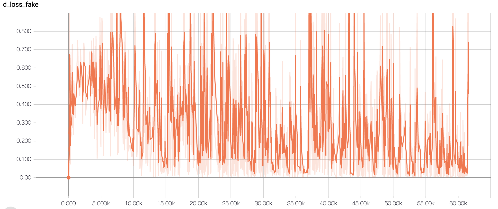
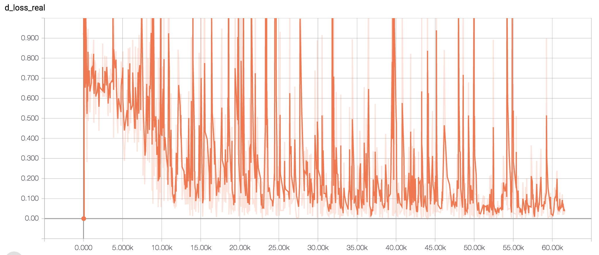
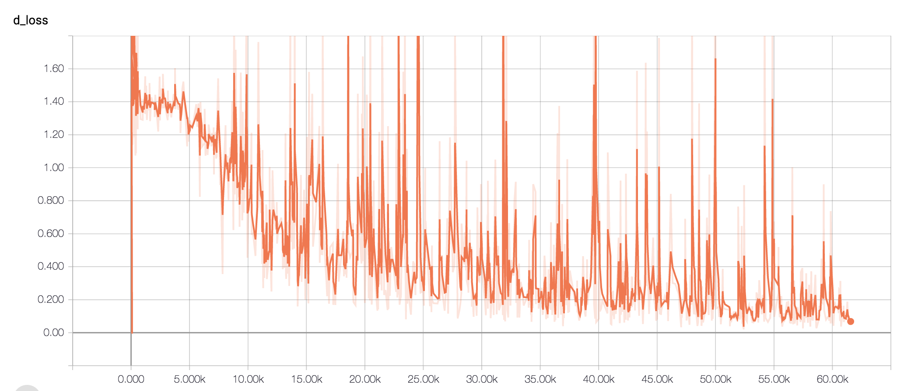
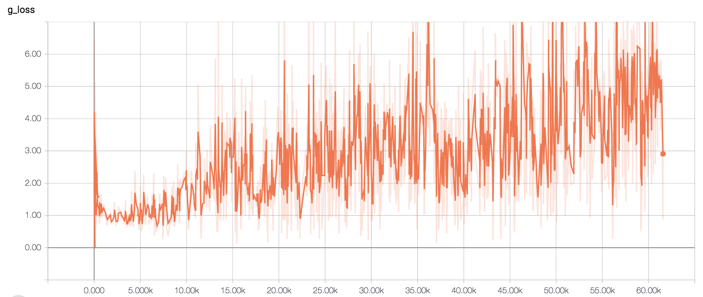
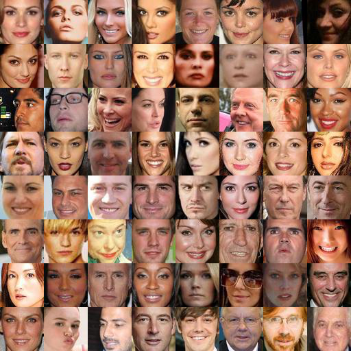
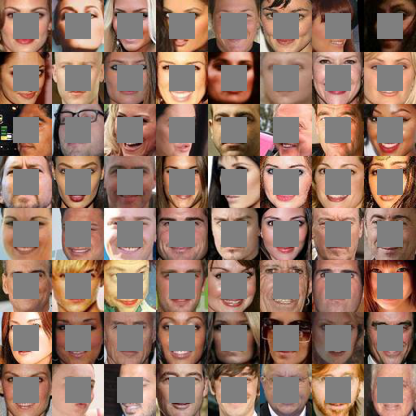

# Image-Completion-DCGAN-Tensorflow

## Introduction
Those code implement the paper [Semantic Image Inpainting with Deep Generative Models](https://arxiv.org/abs/1607.07539)
First of all, we train the dcgan and finanly we train better z. We use z fill into the pre-train dcgan model and generate 
the uncompletion part of images.

## How to run the code
### Pre_requirement
At first, git clone my code.
We use tensorflow 1.4 and python3.5.
Inorder to do images preprocess, we need to use a python library: face_recognition to locate the face of image.
```
pip3 install face_recognition
```
And all the config we can change in file **config.py**.

### Data
We use [CelebA Dataset](http://mmlab.ie.cuhk.edu.hk/projects/CelebA.html), then we need to download img_align_celeba.zip and
unzip all the images to the file **img_align_celeba**.
Choose 300 pictures randomly as testing pictures and move them to file **pre_uncompletion_image**.
Because all the picture is original people pictures and our model need the face pictures whose shape is 64 * 64 * 3,
so that we need to use face_recognition library to locate where is the face and cut them out as same height and wide,
finally, we scale them to 64 * 64 size.
We need to need to run **image_pro.py** in the file **img_align_celeba** to generate images which is for training in 
the file **image** and run **uncompletion_image_pro.py** in the file **pre_uncompletion_image** in the file **uncompletion_image**
Now, all the pictures in the **image** and in **pre_uncompletion_image** are 64 * 64 * 3.
```
cd img_align_celeba
python3 image_pro.py
cd ..
cd pre_uncompletion_image
python3 uncompletion_image_pro.py
cd ..
```

### Train_DCGAN
All the DCGAN details are in file **model.py** including dcgan model and completion function.
To train dcgan, we need to run:
```
python3 train_dcgan.py
```
We will train 20 epoch in DCGAN and this is enough for our purpose.

### Train_completion
After trained DCGAN, we need to train z and for my code, I will randomly choose 64 image in the file **pre_uncompletion_image** and 
run for testing.
```
python3 train_completion.py
```
All the outcome is in file **completions** which we will generate in our code.

## Result
### For DCGAN
d_loss_fake
 

d_loss_real
 

d_loss
 

g_loss
 

### For completion
the example  



the example with mask  



after completion  

